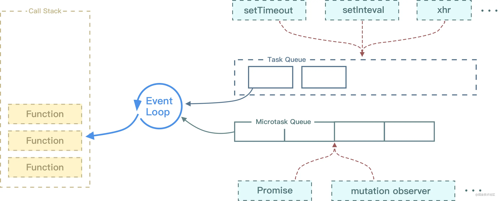

# 事件循环机制

> Event Loop是JavaScript异步编程的核心思想。
>
> JavaScript中的事件循环一直都是一个很多人都或多或少了解，但说不清楚的知识点，停留在一知半解的层面。以前只需要使用回调函数、定时器还好说，但是自从有了Promise之后，对事件循环的透彻了解就比较重要了。


## JS是单线程的

> 我们都知道JavaScript是一门单线程语言，也就是说同一时间只能做一件事。这是因为JavaScript生来作为浏览器脚本语言，主要用来处理与用户的交互、网络以及操作DOM。这就决定了它只能是单线程的，否则会带来很复杂的同步问题。
>
> 假设JavaScript有两个线程，一个线程在某个DOM节点上添加内容，另一个线程删除了这个节点，这时浏览器应该以哪个线程为准？既然JavaScript是单线程的，它就像是只有一个窗口的银行，客户不得不排队一个一个的等待办理。同理JavaScript的任务也要一个接一个的执行，如果某个任务（比如加载高清图片）是个耗时的任务，那浏览器岂不是要一直卡着？为了防止主线程的阻塞，JavaScript有了同步和异步的概念。


## 浏览器是多线程

### 1.GUI渲染线程

> - 负责渲染浏览器界面，解析HTML，CSS，构建DOM树和RenderObject树，布局和绘制等。
> - 当界面需要重绘（repaint）或由于某种操作引发回流（reflow）时，该线程就会执行。
> - 注意，**GUI渲染线程与JS引擎线程是互斥的**，当JS引擎执行GUI线程会被挂起（相当于被冻结了），GUI更新会被保存在一个队列中**等到JS引擎空闲时**立即被执行。


### 2.JS引擎线程

> - 也就是主线程。
> - 也称为JS内核，负责处理JavaScript脚本程序。（例如V8引擎）
> - JS引擎线程负责解析JavaScript脚本，运行代码。
> - JS引擎一直等待着任务队列中任务的到来，然后加以处理，一个Tab页（renderer进程）中无论什么时候都只有一个JS线程在运行JS程序。
> - 同样注意，GUI渲染线程与JS引擎线程是互斥的，所以如果JS执行的时间过长，这样就会造成页面的渲染不连贯，导致页面渲染加载阻塞。


## 3.事件触发线程

> - 归属于浏览器而不是JS引擎，用来控制事件循环（可以理解，JS引擎自己都忙不过来，需要浏览器另开线程协助）
> - 当JS引擎执行代码块如setTimeout时（也可来自浏览器内核的其他线程，如鼠标点击、Ajax异步请求等），会将对应任务添加到事件线程中。
> - 当对应的事件符合触发条件被触发时，该线程会把事件添加到待处理队列的队尾，等待JS引擎的处理。
> - 注意，由于JS的单线程关系，所以这些待处理队列中的事件都得排队等待JS引擎处理（当JS引擎空闲时才会去执行）


### 4.定时触发器线程

> - 传说中setInterval与setTimeout所在线程。
> - 浏览器定时计数器并不是由JS引擎计数的，（因为JS引擎是单线程的，如果处于阻塞线程状态就会影响计时的准确性）
> - 因此通过单独线程来计时并触发定时（计时完毕后，添加到事件队列中，等待JS引擎空闲后执行）
> - 注意W3C在HTML标准中规定，规定要求setTimeout中低于4ms的时间间隔算为4ms。HTML5标准规定了setTimeout()的第二个参数的最小值（最短间隔），不得低于4毫秒，如果低于这个值，就会自动增加。


### 异步HTTP请求线程

> - XMLHttpRequest在连接后是通过浏览器新开一个线程请求。
> - 将检测到状态变更时，如果设置有回调函数，异步线程就产生状态变更事件，将这个回调再放入事件队列中。再由JavaScript引擎执行。


## 同步

**如果在一个函数返回的时候，调用者就能得到预期的结果，那么这个函数就是同步的。也就是说同步方法调用一旦开始，调用者必需等到该函数调用返回后，才能继续后续的行为。下面这段代码首先会弹出alert框，如果不点击确定按钮，所有的页面交互都会被锁死，并且后续的console语句不会被打印出来。**

```js
alert('Spring')
console.log('is')
console.log('the')
console.log('best')
```


## 异步

**如果在函数返回的时候，调用者还不能够得到预期结果，而是需要在将来通过一定的手段得到，那么这个函数就是异步的。比如说发一个网络请求，我们告诉主程序等到接收到数据后再通知我，然后我们就可以去做其他的事情了。当异步完成后会通知到我们，但是此时可能程序正在做其他的事情，所以即使异步完成了也需要在一旁等待，等到程序空闲下来才有时间去看那些异步已经完成了，再去执行。**

**这也就是定时器并不能精确地在指定时间后输出回调函数结果的原因。**

```js
setTimeout(() => {
    console.log('Spring')
}, 1000)

for (let i = 0; i < 100000000; i+=1) {
    // todo
}
```


## 执行栈

**当我们调用一个方法的时候，JavaScript会生成一个与这个方法对应的执行环境，又叫执行上下文（context）。这个执行环境中保存着该方法的私有作用域，上层作用域（作用域链）、方法的参数，以及这个作用域中定义的变量和this的指向，而当一系列方法被依次调用的时候，由于JavaScript是单线程的，这些方法就会按顺序被排列在一个单独的地方，这个地方就是所谓的执行栈。**

**全局执行上下文** — 这是默认或者说基础的上下文，任何不在函数内部的代码都在全局上下文中。它会执行两件事：创建一个全局的 window 对象（浏览器的情况下），并且设置 `this` 的值等于这个全局对象。一个程序中只会有一个全局执行上下文。

**函数执行上下文** — 每当一个函数被调用时, 都会为该函数创建一个新的上下文。每个函数都有它自己的执行上下文，不过是在函数被调用时创建的。函数上下文可以有任意多个。每当一个新的执行上下文被创建，它会按定义的顺序执行一系列步骤。

**Eval 函数执行上下文** — 执行在 `eval` 函数内部的代码也会有它属于自己的执行上下文，但由于 JavaScript 开发者并不经常使用 `eval`，所以在这里我不会讨论它。


## 任务队列

**事件队列是一个存储着异步任务的队列，其中的任务按照时间先后顺序执行，排在队头的任务将会率先执行，而排在队尾的任务会最后执行。事件队列每次执行一个任务，在该任务执行完毕之后，在执行下一个任务。执行栈则是一个类似函数调用栈的运行容器，当执行栈为空时，JS引擎便检查事件队列，如果事件队列不为空的话，事件队列便将第一个任务压入执行栈中运行。**


## 事件循环(Event Loop)

**我们注意到，在异步代码完成后仍有可能要在一旁等待，因为此时程序可能在做其他的事情，等到程序空闲下来才有时间去看哪些异步已经完成了。所以JavaScript有一套机制去处理同步和异步操作，那就是事件循环（Event Loop）。**


从上图我们可以看出：

1. 将所有任务看成两个队列：执行队列与事件队列。
2. 执行队列是同步的，事件队列是异步的，宏任务放入事件列表，微任务放入执行队列之后，事件队列之前。
3. 当执行完同步代码之后，就会执行位于执行列表之后的微任务，然后再执行事件列表中的宏任务

先执行`script`宏任务，执行完了之后，再执行其他两个定时器宏任务。




## **宏任务**(macrotask/task)

| #                     | 浏览器 | Node |
| --------------------- | ------ | ---- |
| setTimeout            | √      | √    |
| setInterval           | √      | √    |
| setImmediate          | x      | √    |
| requestAnimationFrame | √      | x    |

 **这里注意：script（整体代码）即一开始在主执行栈中的同步代码本质上也属于macrotask，属于第一个执行的task。**


## **微任务**(microtack)

| #                          | 浏览器 | Node |
| -------------------------- | ------ | ---- |
| process.nextTick           | x      | √    |
| MutationObserver           | √      | x    |
| Promise.then catch finally | √      | √    |

 这里注意：new Promise执行器触发是同步的，是宏任务。

```js
// 同步任务 (script中的同步代码)
// 异步任务 （宏任务macroTask/task, 微任务microTask)
// 同步任务优先级高于异步任务
// 异步任务中的微任务 > 异步任务的宏任务
```

