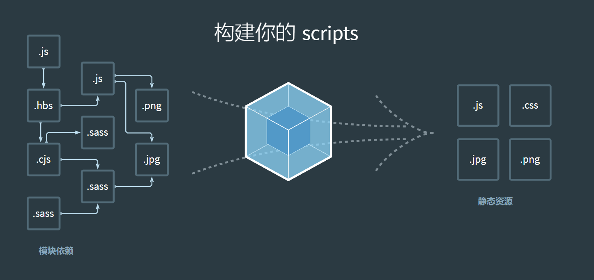

# webpack5

[webpack中文文档]: https://webpack.docschina.org/concepts/
[深入浅出Webpack]: http://webpack.wuhaolin.cn/



## webpack的5个核心概念

### 入口(entry)

**入口起点(entry point)** 指示 webpack 应该使用哪个模块，来作为构建其内部 [依赖图(dependency graph)](https://webpack.docschina.org/concepts/dependency-graph/) 的开始。进入入口起点后，webpack 会找出有哪些模块和库是入口起点（直接和间接）依赖的。

默认值是 `./src/index.js`，但你可以通过在 [webpack configuration](https://webpack.docschina.org/configuration) 中配置 `entry` 属性，来指定一个（或多个）不同的入口起点。例如：

**webpack.config.js**

```javascript
module.exports = {
  entry: './path/to/my/entry/file.js',
};
```


### 输出(output)

**output** 属性告诉 webpack 在哪里输出它所创建的 *bundle*，以及如何命名这些文件。主要输出文件的默认值是 `./dist/main.js`，其他生成文件默认放置在 `./dist` 文件夹中。

你可以通过在配置中指定一个 `output` 字段，来配置这些处理过程：

**webpack.config.js**

```javascript
const path = require('path');

module.exports = {
  entry: './path/to/my/entry/file.js',
  output: {
    path: path.resolve(__dirname, 'dist'),
    filename: 'my-first-webpack.bundle.js',
  },
};
```


### loader

loader让webpack能够去处理非JavaScript文件（webpack自身只理解JavaScript）

**第一步：安装相应loader**

`npm i css-loader style-loader -D`

**第二步：使用loader**

在你的应用程序中，有两种使用 loader 的方式：

- [配置方式](https://webpack.docschina.org/concepts/loaders/#configuration)（推荐）：在 **webpack.config.js** 文件中指定 loader。

```javascript
const path = require('path')

module.exports = {
	entry: './src/index.js',
	output: {
		filename: 'main.js',
		path: path.resolve(__dirname, 'dist'),
	},
	module: {
		rules: [
			// 配置方式指定loader
			{
				test: /\.css$/,
				use: [
					'style-loader',
					'css-loader',
					{
						loader: 'postcss-loader',
						options: {
							postcssOptions: {
								plugins: ['postcss-preset-env'],
							},
						},
					},
				],
			},
			{
				test: /\.less$/,
				use: ['style-loader', 'css-loader', 'postcss-loader', 'less-loader'],
			},
		],
	},
}
```


- [内联方式](https://webpack.docschina.org/concepts/loaders/#inline)：在每个 `import` 语句中显式指定 loader

可以在 `import` 语句或任何[等效于 "import" 的方式](https://doc.webpack-china.org/api/module-methods)中指定 loader。使用 `!` 将资源中的 loader 分开。分开的每个部分都相对于当前目录解析。

```javascript
import 'style-loader!css-loader?modules!./styles.css';
```

通过前置所有规则及使用 `!`，可以对应覆盖到配置中的任意 loader。

选项可以传递查询参数，例如 `?key=value&foo=bar`，或者一个 JSON 对象，例如 `?{"key":"value","foo":"bar"}`。


### 插件(plugin)

插件(plugin)是用来扩展 Webpack 功能的，通过在构建流程里注入钩子实现，它给 Webpack 带来了很大的灵活性。插件目的在于解决 [loader](https://webpack.docschina.org/concepts/loaders) 无法实现的**其他事**。Webpack 提供很多开箱即用的 [插件](https://webpack.docschina.org/plugins/)。

**第一步：安装相应plugin**

`npm i clean-webpack-plugin -D`

**第二步：使用plugin**

在webpack.config.js中配置

```javascript
const { CleanWebpackPlugin } = require('clean-webpack-plugin') // 清空打包目录

plugins: [
  new CleanWebpackPlugin(), // 具体参数参照插件的github仓库
]
```


### 模式(mode)

通过选择 `development`, `production` 或 `none` 之中的一个，来设置 `mode` 参数，你可以启用 webpack 内置在相应环境下的优化。其默认值为 `production`。

```javascript
module.exports = {
  mode: 'production',
}
```


## 使用不同的配置文件

 **默认配置文件为webpack.config.js，可对其更换名称**

如果出于某些原因，需要根据特定情况使用不同的配置文件，

则可以通过在命令行中使用 `--config` 标志修改。

**package.json**

```json
"scripts": {
  "build": "webpack --config prod.config.js"
}
```


**webpack.config.js**

```javascript
const path = require('path');

module.exports = {
  mode: "production", // "production" | "development" | "none"
  // Chosen mode tells webpack to use its built-in optimizations accordingly.
  entry: "./app/entry", // string | object | array
  // 默认为 ./src
  // 这里应用程序开始执行
  // webpack 开始打包
  output: {
    // webpack 如何输出结果的相关选项
    path:path.resolve(__dirname, "dist"), // string (default)
    // 所有输出文件的目标路径
    // 必须是绝对路径（使用 Node.js 的 path 模块）
    filename: "[name].js", // string (default)
    // entry chunk 的文件名模板
    publicPath: "/assets/", // string
    // 输出解析文件的目录，url 相对于 HTML 页面
    library: { // 这里有一种旧的语法形式可以使用（点击显示）
      type: "umd", // 通用模块定义
      // the type of the exported library
      name: "MyLibrary", // string | string[]
      // the name of the exported library

      /* Advanced output.library configuration (click to show) */
    },
    uniqueName: "my-application", // (defaults to package.json "name")
    // unique name for this build to avoid conflicts with other builds in the same HTML
    name: "my-config",
    // name of the configuration, shown in output
    /* 高级输出配置（点击显示） */
    /* Expert output configuration 1 (on own risk) */
    /* Expert output configuration 2 (on own risk) */
  },
  module: {
    // 模块配置相关
    rules: [
      // 模块规则（配置 loader、解析器等选项）
      {
        // Conditions:
        test: /\.jsx?$/,
        include: [
          path.resolve(__dirname, "app")
        ],
        exclude: [
          path.resolve(__dirname, "app/demo-files")
        ],
        // these are matching conditions, each accepting a regular expression or string
        // test and include have the same behavior, both must be matched
        // exclude must not be matched (takes preferrence over test and include)
        // Best practices:
        // - Use RegExp only in test and for filename matching
        // - Use arrays of absolute paths in include and exclude to match the full path
        // - Try to avoid exclude and prefer include
        // Each condition can also receive an object with "and", "or" or "not" properties
        // which are an array of conditions.
        issuer: /\.css$/,
        issuer: path.resolve(__dirname, "app"),
        issuer: { and: [ /\.css$/, path.resolve(__dirname, "app") ] },
        issuer: { or: [ /\.css$/, path.resolve(__dirname, "app") ] },
        issuer: { not: [ /\.css$/ ] },
        issuer: [ /\.css$/, path.resolve(__dirname, "app") ], // like "or"
        // conditions for the issuer (the origin of the import)
        /* Advanced conditions (click to show) */

        // Actions:
        loader: "babel-loader",
        // 应该应用的 loader，它相对上下文解析
        options: {
          presets: ["es2015"]
        },
        // options for the loader
        use: [
          // apply multiple loaders and options instead
          "htmllint-loader",
          {
            loader: "html-loader",
            options: {
              // ...
            }
          }
        ],
        type: "javascript/auto",
        // specifies the module type
        /* Advanced actions (click to show) */
      },
      {
        oneOf: [
          // ... (rules)
        ]
        // only use one of these nested rules
      },
      {
        // ... (conditions)
        rules: [
          // ... (rules)
        ]
        // use all of these nested rules (combine with conditions to be useful)
      },
    ],
    /* 高级模块配置（点击展示） */
  },
  resolve: {
    // options for resolving module requests
    // (does not apply to resolving of loaders)
    modules: ["node_modules",path.resolve(__dirname, "app")],
    // directories where to look for modules (in order)
    extensions: [".js", ".json", ".jsx", ".css"],
    // 使用的扩展名
    alias: {
      // a list of module name aliases
      // aliases are imported relative to the current context
      "module": "new-module",
      // 别名："module" -> "new-module" 和 "module/path/file" -> "new-module/path/file"
      "only-module$": "new-module",
      // 别名 "only-module" -> "new-module"，但不匹配 "only-module/path/file" -> "new-module/path/file"
      "module": path.resolve(__dirname, "app/third/module.js"),
      // alias "module" -> "./app/third/module.js" and "module/file" results in error
      "module": path.resolve(__dirname, "app/third"),
      // alias "module" -> "./app/third" and "module/file" -> "./app/third/file"
      [path.resolve(__dirname, "app/module.js")]: path.resolve(__dirname, "app/alternative-module.js"),
      // alias "./app/module.js" -> "./app/alternative-module.js"
    },
    /* 可供选择的别名语法（点击展示） */
    /* 高级解析选项（点击展示） */
    /* Expert resolve configuration (click to show) */
  },
  performance: {
    hints: "warning", // 枚举
    maxAssetSize: 200000, // 整数类型（以字节为单位）
    maxEntrypointSize: 400000, // 整数类型（以字节为单位）
    assetFilter: function(assetFilename) {
      // 提供资源文件名的断言函数
      return assetFilename.endsWith('.css') || assetFilename.endsWith('.js');
    }
  },
  devtool: "source-map", // enum
  // 通过为浏览器调试工具提供极其详细的源映射的元信息来增强调试能力，
  // 但会牺牲构建速度。
  context: __dirname, // string（绝对路径！）
  // webpack 的主目录
  // entry 和 module.rules.loader 选项
  // 都相对于此目录解析
  target: "web", // 枚举
  // the environment in which the bundle should run
  // changes chunk loading behavior, available external modules
  // and generated code style
  externals: ["react", /^@angular/],
  // Don't follow/bundle these modules, but request them at runtime from the environment
  externalsType: "var", // (defaults to output.library.type)
  // Type of externals, when not specified inline in externals
  externalsPresets: { /* ... */ },
  // presets of externals
  ignoreWarnings: [/warning/],
  stats: "errors-only",
  stats: {
    // lets you precisely control what bundle information gets displayed
    preset: "errors-only",
    // A stats preset

    /* Advanced global settings (click to show) */

    env: true,
    // include value of --env in the output
    outputPath: true,
    // include absolute output path in the output
    publicPath: true,
    // include public path in the output

    assets: true,
    // show list of assets in output
    /* Advanced assets settings (click to show) */

    entrypoints: true,
    // show entrypoints list
    chunkGroups: true,
    // show named chunk group list
    /* Advanced chunk group settings (click to show) */

    chunks: true,
    // show list of chunks in output
    /* Advanced chunk group settings (click to show) */

    modules: true,
    // show list of modules in output
    /* Advanced module settings (click to show) */
    /* Expert module settings (click to show) */

    /* Advanced optimization settings (click to show) */

    children: true,
    // show stats for child compilations

    logging: true,
    // show logging in output
    loggingDebug: /webpack/,
    // show debug type logging for some loggers
    loggingTrace: true,
    // show stack traces for warnings and errors in logging output

    warnings: true,
    // show warnings

    errors: true,
    // show errors
    errorDetails: true,
    // show details for errors
    errorStack: true,
    // show internal stack trace for errors
    moduleTrace: true,
    // show module trace for errors
    // (why was causing module referenced)

    builtAt: true,
    // show timestamp in summary
    errorsCount: true,
    // show errors count in summary
    warningsCount: true,
    // show warnings count in summary
    timings: true,
    // show build timing in summary
    version: true,
    // show webpack version in summary
    hash: true,
    // show build hash in summary
  },
  devServer: {
    proxy: { // proxy URLs to backend development server
      '/api': 'http://localhost:3000'
    },
    static: path.join(__dirname, 'public'), // boolean | string | array, static file location
    compress: true, // enable gzip compression
    historyApiFallback: true, // true for index.html upon 404, object for multiple paths
    hot: true, // hot module replacement. Depends on HotModuleReplacementPlugin
    https: false, // true for self-signed, object for cert authority
    noInfo: true, // only errors & warns on hot reload
    // ...
  },
  experiments: {
    asyncWebAssembly: true,
    // WebAssembly as async module (Proposal)
    syncWebAssembly: true,
    // WebAssembly as sync module (deprecated)
    outputModule: true,
    // Allow to output ESM
    topLevelAwait: true,
    // Allow to use await on module evaluation (Proposal)
  },
  plugins: [
    // ...
  ],
  // list of additional plugins
  optimization: {
    chunkIds: "size",
    // method of generating ids for chunks
    moduleIds: "size",
    // method of generating ids for modules
    mangleExports: "size",
    // rename export names to shorter names
    minimize: true,
    // minimize the output files
    minimizer: [new CssMinimizer(), "..."],
    // minimizers to use for the output files

    /* Advanced optimizations (click to show) */

    splitChunks: {
      cacheGroups: {
        "my-name": {
          // define groups of modules with specific
          // caching behavior
          test: /\.sass$/,
          type: "css/mini-extract",

          /* Advanced selectors (click to show) */

          /* Advanced effects (click to show) */
        }
      },

      fallbackCacheGroup: { /* Advanced (click to show) */ }

      /* Advanced selectors (click to show) */

      /* Advanced effects (click to show) */

      /* Expert settings (click to show) */
    }
  },
  /* 高级配置（点击展示） */
  /* Advanced caching configuration (click to show) */
  /* Advanced build configuration (click to show) */
}
```


## postcss工作流程

**给CSS加浏览器前缀的三个重要工具：**

> browserslist autoprefixer postcss

browserslist 的数据都是来自[Can I Use](https://caniuse.com/)的。

使用cli实现：

`npx postcss --use autoprefixer -o ret.css ./src/css/test.css`

**1.安装postcss-loader ,postcss-preset-env**

`npm i postcss-loader postcss-preset-env -D`

安装postcss-preset-env，无需再安装autoprefixer，由于postcss-preset-env已经内置了相关功能。

postcss-preset-env中还有很多CSS的扩展工具，如使用下一代CSS语法等。


**2.添加.browserlistrc文件到项目根目录**

> \> **1**% in CN
>  android >= 4.4
>  ios >= 8
>  not ie <= 11
>
> \> 1%
> last 2 versions
> not dead

这个需要根据项目的实际情况来自由选择。


**3.配置postcss.config.js**

```javascript
module.exports = {
  plugins: [
    require('postcss-preset-env')
  ]
}
```

**或是直接在webpack.config.js中配置**

```javascript
module: {
    rules: [
        // 配置方式指定loader
        {
            test: /\.css$/,
            use: [
                'style-loader',
                'css-loader',
                {
                    loader: 'postcss-loader',
                    options: {
                        postcssOptions: {
                            plugins: ['postcss-preset-env'],
                        },
                    },
                },
            ],
        },
        {
            test: /\.less$/,
            use: ['style-loader', 'css-loader', 'postcss-loader', 'less-loader'],
        },
    ],
},
```


## file-loader打包图片

打包图片：

**img src**

1. 使用require导入图片，此时如果不配置`esModule: false`，则需.default导出。

2. 也可以在配置当中设置`esModule: false`。
3. 采用`import xxx from '../src/img/xx.png'` ，此时可以直接使用xxx。

**background url**

1. 在css中使用`background-image: url('../img/xxx.png');`导入图片。
2. import该css文件，将其添加到依赖图中。
3. 在配置当中添加css-loader的options `esModule: false`。


```javascript
import oImgSrc from '../img/tio.png'
import '../css/img.css'

function packImg() {
  // 1.创建一个容器元素
  const oEle = document.createElement('div')

  // 2.创建img标签，设置src属性
  const oImg = document.createElement('img')
  // oImg.src = require('../img/tio.png').default // webpack5特殊
  // oImg.src = require('../img/tio.png')
  oImg.src = oImgSrc
  oEle.appendChild(oImg)

  // 3.设置背景图片
  const oBgImg = document.createElement('div')
  oBgImg.className = 'bgBox'
  oEle.appendChild(oBgImg)

  return oEle
}

document.body.appendChild(packImg())
```


```javascript
module: {
    rules: [
        // 配置方式指定loader
        {
            test: /\.css$/,
            use: [
                'style-loader',
                {
                    loader: 'css-loader',
                    options: {
                        esModule: false, // 不转为esmodule
                        importLoaders: 1, // 往前找1个loader
                    },
                },
                'postcss-loader',
            ],
        },
        {
            test: /\.less$/,
            use: ['style-loader', 'css-loader', 'postcss-loader', 'less-loader'],
        },
        {
            test: /\.(png|jpe?g|svg|gif)$/,
            use: [
                {
                    loader: 'file-loader',
                    options: {
                        esModule: false, // 不转为esmodule
                    },
                },                  
                'file-loader',
            ],
        },
    ],
},
```


## url-loader处理图片

url-loader base64 url文件当中，减少请求次数

file-loader 将资源拷贝至指定的目录，分开请求

url-loader 内部其实也可以调用 file-loader

limit 指定限制大小，超过的拷贝，不超过的使用base64

> url-loader会将引入的图片编码，生成dataURl。相当于把图片数据翻译成一串字符。再把这串字符打包到文件中，最终只需要引入这个文件就能访问图片了。当然，如果图片较大，编码会消耗性能。因此url-loader提供了一个limit参数，小于limit字节的文件会被转为DataURl，大于limit的还会使用file-loader进行copy。
>
>   url-loader和file-loader是什么关系呢？简答地说，url-loader封装了file-loader。url-loader不依赖于file-loader，即使用url-loader时，只需要安装url-loader即可，不需要安装file-loader，因为url-loader内置了file-loader。通过上面的介绍，我们可以看到，url-loader工作分两种情况：1.文件大小小于limit参数，url-loader将会把文件转为DataURL；2.文件大小大于limit，url-loader会调用file-loader进行处理，参数也会直接传给file-loader。因此我们只需要安装url-loader即可。

```javascript
{
    test: /\.(png|jpe?g|svg|gif)$/,
    use: [
        {
            loader: 'url-loader',
            options: {
                esModule: false, // 不转为esmodule
                name: 'img/[name].[hash:6].[ext]',
                limit: 45 * 1024, // 最大45mb
                // outputPath: 'img', // 输出路径
            },
        },
    ],
},
```


## asset处理图片

webpack5内置，无需安装。

01 asset/resource --> file-loader （输出路径）

02 asset/inline --> url-loader （data uri）

03 asset/source --> raw-loader

04 asset （parser）

```javascript
{
    test: /\.(png|jpe?g|svg|gif)$/,
    type: 'asset',
    generator: {
        filename: 'img/[name]_[hash:4][ext]',
    },
    parser: {
        dataUrlCondition: {
            maxSize: 45 * 1024,
        },
    },
},
```


## asset处理字体图标

```javascript
{
    test: /\.(ttf|woff2?)$/,
    type: 'asset/resource',
    generator: {
      filename: 'font/[name]_[hash:3][ext]',
    },
},
```


## 常用plugin的使用

plugin是一个类，使用时需要创建实例。

```javascript
const path = require('path') // node.js中的path模块
const CopyWebpackPlugin = require('copy-webpack-plugin') // 拷贝目录下的静态资源到输出文件夹
const { DefinePlugin } = require('webpack') // 生成模板中使用的常量
const { CleanWebpackPlugin } = require('clean-webpack-plugin') // 清空打包目录 
const HtmlWebpackPlugin = require('html-webpack-plugin') // 自动生成html模板

plugins: [
    new CleanWebpackPlugin(), // 具体参数参照插件的github仓库
    new HtmlWebpackPlugin({
        title: 'Hello Webpack', // 规定生成的html标题
        template: './public/index.html', // 按照给定的模板html生成html
    }),
    new DefinePlugin({
        BASE_URL: "'./'", // 需要内嵌一个引号，不然会是./而不是'./'
    }),
    new CopyWebpackPlugin({
        patterns: [
            {
                from: 'public', // 从哪个目录开始拷贝
                globOptions: {
                    // 写上**/表示从public找，不写默认从根目录找
                    ignore: ['**/index.html'], // 写要忽略的目录
                },
            },
        ],
    }),
],
```


## babel和babel-loader使用

使用cli实现：

`npx babel src --out-dir build --plugins=@babel/plugin-transform-arrow-functions,@babel/plugin-transform-block-scoping`

`npx babel src --out-dir build --presets=@babel/preset-env`

**1.安装babel-loader，@babel/preset-env**

`npm i babel-loader @babel/preset-env -D`

安装@babel/preset-env，无需再安装其他babel插件，由于@babel/preset-env已经内置了常用插件。


**2.在webpack.config.js中使用babel-loader并配置相应插件**

```javascript
{
    test: /\.js$/,
    use: [
        {
            loader: 'babel-loader',
            options: {
                presets: ['@babel/preset-env'],
            },
        },
    ],
},
```

**也可以在babel.config.js中配置**

> babel-loader相关配置文件：
>
> babel.config.js(json cjs mjs) 推荐使用js或json格式
>
> babelrc.json(js) babel7以下常用

```javascript
module.exports = {
	presets: ['@babel/preset-env'],
}
```

**vue-cli中的babel.config.js配置**

```javascript
module.exports = {
  presets: [
    '@vue/cli-plugin-babel/preset'
  ]
}
```


**3.添加.browserlistrc文件到项目根目录**

> \> **1**% in CN
> android >= 4.4
> ios >= 8
> not ie <= 11
>
> \> 1%
> last 2 versions
> not dead

这个需要根据项目的实际情况来自由选择。

**也可以在webpack.config.js中指定要兼容的条件（不推荐）**

同时存在.browserlistrc文件和指定条件时，以配置中的指定条件为准。

```javascript
{
    test: /\.js$/,
    use: [
        {
            loader: 'babel-loader',
            options: {
                presets: [
                    [
                      '@babel/preset-env',
                      {targets: 'chrome 91'},
                    ]
                ],
            },
        },
    ],
},
```


## polyfill配置

**1.安装core-js regenerator-runtime至生产环境**

`npm i core-js regenerator-runtime`

**2.在babel.config.js中配置**

```javascript
module.exports = {
	presets: [
    [
      '@babel/preset-env',
      { 
        // 默认false: 不对当前js处理做polyfill的填充
        // usage: 依据用户源码当中所使用到的新语法进行填充
        // entry: 依据我们当前筛选出来的浏览器决定填充什么
        useBuiltIns: 'entry',
        corejs: 3, // 填写所安装的corejs的大版本
      }
    ]
  ],
}
```

当`useBuiltIns: 'entry'`时还需在入口文件中引入core-js regenerator-runtime

```javascript
import 'core-js/stable'
import 'regenerator-runtime/runtime'
```


## webpack-dev-server和webpack-dev-middleware

**1.安装webpack-dev-server**

`npm i webpack-dev-server -D`

**2.在package.json中配置**

```javascript
"scripts": {
    "test": "echo \"Error: no test specified\" && exit 1",
    "build": "webpack",
    "serve": "webpack serve"
},
```

**3.在终端输入**`npm run serve`**运行**


**1.安装webpack-dev-middleware**

`npm i webpack-dev-middleware`

**2.使用express开启端口服务**

```javascript
const express = require('express')
const webpackDevMiddleware = require('webpack-dev-middleware')
const webpack = require('webpack')

const app = express()

// 获取配置文件
const config = require('./webpack.config.js')
const compiler = webpack(config)

app.use(webpackDevMiddleware(compiler))

// 开启端口上的服务
app.listen(3000, () => {
	console.log('服务运行在3000端口上')
})
```


## 模块热替换(HMR)

模块热替换(hot module replacement 或 HMR)是 webpack 提供的最有用的功能之一。

热替换需要先安装webpack-dev-server或[`webpack-hot-middleware`](https://github.com/webpack-contrib/webpack-hot-middleware)

**1.在webpack.config.js中配置**

```javascript
module.exports = {
  devServer: {
    hot: true, // 开启热替换
  },
}
```


**2.修改入口文件**

```javascript
if (module.hot) {
	module.hot.accept(['./js/utils.js', './js/font.js'], () => {
    console.log('模块更新了')
  })
}
```


## Vue组件及其热替换

[vue-loader官方文档]: https://vue-loader.vuejs.org/zh/

**1.安装Vue和vue-template-compiler**

安装Vue2：`npm i vue` 

安装Vue3：`npm i vue@next`

安装vue-template-compiler：`npm i vue-template-compiler -D`


**2.安装vue-loader**

Vue2：`npm i vue-loader@14 -D` 需安装14或15及以下版本，

@14无需VueLoaderPlugin插件，开箱即用。@15用法与@16一致，需要引入VueLoaderPlugin插件。

Vue3：`npm i vue-loader@16 -D` Vue3必须使用16及以上版本的vue-loader。


**3.在webpack.cofig.js中配置**

```javascript
const { VueLoaderPlugin } = require('vue-loader')

module.exports = {
  module: {
    rules: [
      // ... 其它规则
      {
        test: /\.vue$/,
        loader: 'vue-loader'
      }
    ]
  },
  plugins: [
    // 请确保引入这个插件！
    new VueLoaderPlugin()
  ]
}
```


## output和devServer中的path

**output**

publicPath: index.html内部的引用路径

path: 域名 + publicPath + filename

一般设置为`publicPath: '/'`。

```javascript
output: {
    filename: 'js/main.js', // 输出文件
    path: path.resolve(__dirname, 'dist'),
    // publicPath: '/', // path: 域名 + publicPath + filename
    // assetModuleFilename: 'img/[name]_[hash:4][ext]',
},
```


**devServer**

[`static.directory`](https://webpack.docschina.org/configuration/dev-server/#directory) 我们打包之后的资源如果依赖其他的资源，此时就告知去哪找。

[`static.publicPath`](https://webpack.docschina.org/configuration/dev-server/#publicpath) 将会被用来决定应该从哪里提供 bundle，并具有优先级。

```javascript
module.exports = {
	devServer: {
		hot: true,
		static: {
			directory: path.join(__dirname, 'public'),
			watch: true, // 不写默认true
		},
	},
}
```


## devServer常用配置

```javascript
module.exports = {
	resolve: {
		extensions: ['.js', '.json', '.ts', '.jsx', '.vue'], // 使模块路径识别这些后缀
		alias: {
			'@': path.resolve(__dirname, 'src'), // 别名，用于简写
		},
	},
	devServer: {
		hot: 'only', // 出错时不刷新页面，只刷新出错的模块
		port: 4000, // 指定端口
		open: false, // 构建完成打开新窗口
		compress: true, // gzip压缩
		historyApiFallback: true, // 前端路由404时返回index.html
		static: {
			directory: path.join(__dirname, 'public'),
			watch: true, // 不写默认true
		},
		proxy: {
			'/api': {
				target: 'https://api.github.com/', // 转发目标
				pathRewrite: { '^/api': '' }, // 重写路由路径
				changeOrigin: true, // 更改host来源
			},
		},
	},
}
```


